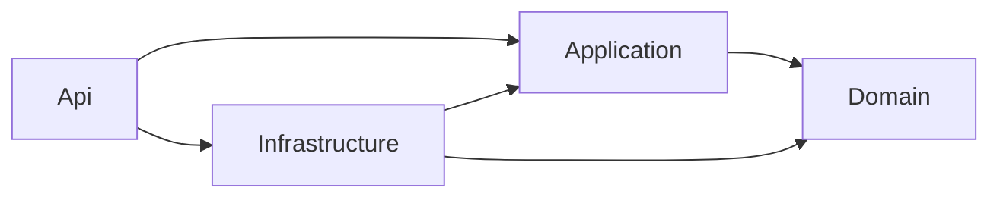

# FCG.UsersAPI

Microsserviço de usuários e autenticação do FIAP Cloud Games, Tech Challenge Fase 2, em **.NET 8**.

## Estado atual

**E10 concluída localmente em 06/10/2026:** contrato e topologia de UserCreatedEvent comprovados em oito cenários com RabbitMQ real e Notifications original. Publish comum retornou sucesso sem rota; confirms + mandatory detectaram NO_ROUTE e permitiram recuperação com mesmos IDs. [Guia E10](docs/aprendizado/E10-CONTRATO-E-PROVA-RABBITMQ.md), [contrato](docs/contratos/CONTRATO-USERCREATED-E-TOPOLOGIA.md) e [evidências](docs/evidencias/E10/README.md).

A prova usa a identidade atual da branch do colega e uma ferramenta separada. O cadastro ainda não publica nem registra Outbox; próximo passo **E11**, persistir usuário, auditoria e evento juntos. Restam **quatro entregas E11–E14**.

**Base E09 concluída localmente em 06/10/2026:** consulta/edição por titular ou administrador, cadastro administrativo, troca de perfil e inativação, com as quatro auditorias conectadas ao banco próprio. Alteração e auditoria são confirmadas juntas; administração e emissão de tokens do mesmo usuário são coordenadas no PostgreSQL.

**387 testes aprovados na E09, sem reexecução na E10:** 106 unitários e 281 de integração/configuração/HTTP/segurança. Release sem erros/avisos; Kestrel/PostgreSQL reais e validação JWT somente com pública demonstrados. Veja [guia E09](docs/aprendizado/E09-OPERACOES-PROTEGIDAS-E-AUDITORIA.md) e [evidências](docs/evidencias/E09/README.md).

Login/refresh devolvem access RS256 de 15 minutos, refresh por hash/7 dias e usuario. Nome/e-mail ficam fora das claims. Logout revoga sessões renováveis; perfil/inativação passam a valer em novas emissões. JWT anterior conserva suas claims até expirar, com tolerância de 30 segundos.

Branch atual: `feature/c11-persistencia-migration`, base `5f438ea` (`C10`), que já contém o código anterior commitado por Matheus. E09/E10 locais, **sem commit/push**; docs/scripts restaurados também locais. Nenhum card encerrado.

## Pré-requisitos

- Git e SDK .NET **8.0.423** ou patch compatível conforme global.json.
- PowerShell **7.4+** para os roteiros locais.
- Docker Desktop com engine Linux funcionando para PostgreSQL local e testes.
- NuGet e imagens de teste disponíveis na primeira execução.

A prova E10 utiliza um RabbitMQ descartável, preparado/encerrado pelo runner. A API de produção ainda não exige broker. O diagnóstico de Docker nesta máquina está nas [evidências E09](docs/evidencias/E09/README.md).

## Executar localmente

Na raiz do repositório, no mesmo PowerShell 7.4+:

```powershell
dotnet tool restore
dotnet restore FCG.Users.sln
dotnet build FCG.Users.sln --configuration Release --no-restore
.\scripts\Configurar-PostgresLocal.ps1
.\scripts\Configurar-JwtLocal.ps1 -CriarChaves
dotnet tool run dotnet-ef database update --project src/FCG.Users.Infrastructure --startup-project src/FCG.Users.Infrastructure --configuration Release --no-build
.\scripts\Inicializar-AdministradorLocal.ps1 -CriarCredenciais
dotnet run --project src/FCG.Users.Api --configuration Release --no-build --launch-profile http
```

O PostgreSQL próprio usa `fcg-usersapi-postgres`, volume `fcg-usersapi-postgres-data` e **127.0.0.1:55432**. A senha aleatória fica em `.env.usersdb`, ignorado pelo Git. O script configura a conexão somente na sessão atual; o banco do monólito não é usado.

JWT: `-CriarChaves` cria o primeiro par explicitamente, sem substituir o existente. Nas próximas sessões, execute sem essa opção. A privada fica fora do repositório em `%LOCALAPPDATA%\FCG.UsersAPI\jwt\users-local-v1`; apenas a pública é distribuída ao Catalog. A API exige chaves válidas e não gera RSA silenciosamente.

Primeiro administrador: o roteiro gera dados sintéticos/senha aleatória em `.env.adminlocal`, JSON ignorado pelo Git e com acesso local restrito. Executa um modo CLI somente Development/loopback, sem iniciar HTTP e sem precisar de RSA. Se já existe qualquer administrador, não altera usuários/senhas. Nas próximas execuções, use sem `-CriarCredenciais`. Consulte o arquivo local para login manual, sem compartilhar seu conteúdo.

A API não aplica migrations automaticamente. E06–E09 reutilizam o schema da E05. O perfil HTTP inicia em Development na porta **5088**; encerre com Ctrl+C.

## Operações HTTP

| Rota | Permissão e resultado principal |
|---|---|
| GET /health | 200, confirma o processo; não testa banco/broker. |
| POST /api/v1/usuarios | Público; impõe Usuario; 201/400/409. |
| POST /api/v1/auth/login | Público; 200/400/401; access/refresh/usuario. |
| POST /api/v1/auth/refresh | Público; 200/400/401; substitui o par e usa dados atuais. |
| POST /api/v1/auth/logout | Bearer válido; revoga todos os refreshs ativos do sub; 204/401. |
| GET /api/v1/usuarios/{id} | Titular ou Administrador; 200/400/401/403/404. |
| PUT /api/v1/usuarios/{id} | Titular ou Administrador; nome/e-mail/nascimento; 200/400/401/403/404/409. |
| POST /api/v1/usuarios/administradores | Administrador; impõe Administrador; 201/400/401/403/409. |
| PUT /api/v1/usuarios/{id}/perfil | Administrador; perfil existente; 200/400/401/403/404. |
| DELETE /api/v1/usuarios/{id} | Administrador; inativação lógica; 204/400/401/403/404. |

Falhas inesperadas retornam 500 genérico em Problem Details. O DTO de usuário não inclui CPF/nascimento/hash/senha/tokens. O cadastro fornece Location agora consultável com JWT autorizado. PUT/perfil idênticos e DELETE repetido não duplicam auditoria.

Inativação preserva conta/histórico e bloqueia novos login/refresh. Access anterior ainda pode autorizar operações até expirar: sem blacklist central ou consulta ao banco em cada validação. Não há reativação, troca de senha ou proteção do último administrador neste escopo.

[Swagger UI](http://localhost:5088/swagger/index.html) e [OpenAPI](http://localhost:5088/swagger/v1/swagger.json) ficam disponíveis somente em Development com a flag habilitada. A rota `/` não tem página inicial. Os exemplos sintéticos estão em [FCG.Users.Api.http](src/FCG.Users.Api/FCG.Users.Api.http); substitua os marcadores localmente e não versione tokens reais.

## Demonstrações e contrato do Catalog

Depois de banco/migration/RSA e build Release, com porta 5088 livre:

```powershell
.\scripts\Verificar-AdministracaoLocal.ps1
# Alternativa de porta: -Porta 5089
```

O roteiro inicializa/reutiliza o primeiro administrador, inicia Kestrel oculto, demonstra permissões/edição/administração/inativação e consulta quatro auditorias no banco. Também valida JWT somente com a pública e recusa kid/audience incorretos. Encerra apenas a API que iniciou. Contas sintéticas/históricos permanecem no banco, incluindo o usuário demonstrado inativo; reexecutar cria novas contas sintéticas.

[http-local.json](docs/evidencias/E09/http-local.json) registra os resultados sem credenciais; logs locais ficam em TestResults/E09. A demonstração anterior de sessão continua em `scripts/Verificar-SessaoLocal.ps1`.

Para o responsável pelo C14/#57: [contrato JWT para Catalog](docs/contratos/CONTRATO-JWT-PARA-CATALOG.md), com configuração e exemplo .NET 8, e [validador público local](scripts/Validar-TokenComChavePublica.ps1). A prova pública passou; integrar o serviço Catalog real é uma validação conjunta ainda pendente.

## Testes

Com Release compilado e Docker funcionando:

```powershell
dotnet test FCG.Users.sln --configuration Release --no-build --no-restore
```

O Testcontainers cria PostgreSQL 16 descartável em porta aleatória. Não usa volume de desenvolvimento, monólito ou chaves do usuário. Os testes comprovam regras, contratos, permissões, hash, JWT, transações, rollback de auditoria e concorrência entre emissão/administração/refresh/logout.

Somente unitários, sem Docker:

```powershell
dotnet test tests/FCG.Users.UnitTests --configuration Release --no-build --no-restore
```

## Organização

| Projeto/pasta | Responsabilidade |
|---|---|
| Api | Host, controllers, DTOs, JWT/policies HTTP e modo CLI explícito. |
| Application | Casos de uso e interfaces de persistência, segurança e unidade de trabalho. |
| Domain | Entidades e invariantes independentes de banco. |
| Infrastructure | Contexto/mappings/migration, repositórios, transações, hash e RSA. |
| UnitTests | Regras e coordenação com substitutos. |
| IntegrationTests | HTTP, segurança e PostgreSQL reais, incluindo concorrência/CLI. |
| scripts | Preparação de banco/RSA/admin e demonstrações sem exibir credenciais. |
| docs | Guias, planejamento, contratos e evidências. |



Nenhum projeto depende do monólito. Versões centralizadas em Directory.Packages.props; ferramenta EF local em .config/dotnet-tools.json.

## Aprendizado e próximos passos

- [E09 — Operações protegidas e auditoria](docs/aprendizado/E09-OPERACOES-PROTEGIDAS-E-AUDITORIA.md), com exercícios e mapa dos arquivos.
- [Evidências E09](docs/evidencias/E09/README.md).
- [Contrato JWT para Catalog](docs/contratos/CONTRATO-JWT-PARA-CATALOG.md).
- [E08 — Refresh/logout/concorrência](docs/aprendizado/E08-REFRESH-LOGOUT-E-CONCORRENCIA.md).
- [E07 — Login e JWT RS256](docs/aprendizado/E07-LOGIN-E-JWT-RS256.md).
- [E06 — Cadastro e auditoria](docs/aprendizado/E06-CADASTRO-HTTP-E-AUDITORIA.md).
- [E05 — Persistência própria](docs/aprendizado/E05-PERSISTENCIA-PROPRIA.md).
- [Índice completo](docs/README.md).
- [Plano #52–#55](docs/planejamento/PLANO-EXECUCAO-USERSAPI-CARDS-52-55.md).
- [Modelagem/decisões](docs/planejamento/ANALISE-MODELAGEM-USERSAPI-E-DECISOES.md).

Próxima: **E10 — contrato e prova de mensageria**. Restam **cinco entregas, E10–E14**: contrato/prova, Outbox atômica, publicador, recuperação/concorrência e consolidação. Sem prazo fixo; avançamos em pequenos entregáveis conforme a disponibilidade de Matheus.

## Prova de mensageria E10

Use um clone isolado de Notifications no commit `78b512477298cb9b37dbfe38504030d9c3d09a51`, PowerShell 7.4+, Docker Linux e portas 5672/15672/5089 livres:

```powershell
.\scripts\Verificar-MensageriaE10.ps1 -NotificationsRepoPath 'C:\GIT\FCG.NotificationsAPI'
```

O caminho é ilustrativo. O roteiro compila o produtor de prova e a aplicação original por `.csproj`, provisiona vhost/topologia/credenciais locais e executa oito cenários. Resultado em `TestResults/E10/rabbitmq-real.json`; limpa apenas seus processos/container/volumes temporários. Não precisa iniciar UsersAPI, PostgreSQL ou configurar JWT. [Orientações para os cards de integração](docs/planejamento/ORIENTACOES-INTEGRACAO-USERCREATED-E10.md).
