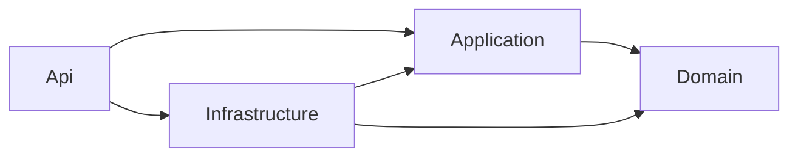

# FCG.UsersAPI

Microsserviço de usuários e autenticação do FIAP Cloud Games, desenvolvido para o Tech Challenge Fase 2 em **.NET 8**.

## Estado atual

**E04 concluída localmente:** domínio, abstrações e casos de uso de usuários/autenticação extraídos do monólito, com **68 testes unitários aprovados**. O host da E03 continua com controllers, DI, Problem Details, Swagger e `/health`, com **15 testes HTTP aprovados**. Build Release com zero erros e avisos.

São **83 testes aprovados no UsersAPI**. O monólito de origem também foi validado antes da extração: 133 testes aprovados. Consulte as [evidências da E04](docs/evidencias/E04/README.md).

O HTTP ainda expõe somente saúde e documentação; cadastro/login não estão disponíveis por rota. Os casos de uso são exercitados nos testes com dependências substitutas. Banco, segurança concreta, JWT RS256 e a conexão dos novos endpoints entram nas entregas seguintes.

A fundação técnica do [FCG #52 / C09](https://github.com/gapima/FCG/issues/52) está implementada localmente; o [#53 / C10](https://github.com/gapima/FCG/issues/53) está parcial. Nenhum desses cards foi encerrado nesta entrega, e E02, E03 e E04 ainda não foram publicadas no GitHub.

## Pré-requisitos

- Git.
- SDK .NET **8.0.423**, usado na validação, ou patch posterior da faixa **8.0.4xx**, conforme `global.json`.
- Acesso ao NuGet para restaurar os pacotes na primeira execução.

PostgreSQL e RabbitMQ ainda não são necessários. O `global.json` seleciona um SDK compatível já instalado; não instala o SDK.

## Executar localmente

Na raiz do repositório:

```powershell
dotnet --version
dotnet restore FCG.Users.sln
dotnet build FCG.Users.sln --configuration Release --no-restore
dotnet run --project src/FCG.Users.Api/FCG.Users.Api.csproj --configuration Release --no-build --launch-profile http
```

O perfil `http` inicia a aplicação em **Development**, em `http://localhost:5088`. Mantenha esse terminal aberto e use outro terminal ou navegador para experimentar. Encerre a aplicação com `Ctrl+C`.

| Endereço | Resultado esperado |
|---|---|
| [GET /health](http://localhost:5088/health) | HTTP 200 e `{"status":"Healthy"}`. Confirma somente que o processo responde. |
| [Swagger UI](http://localhost:5088/swagger/index.html) | Interface para consultar e executar o endpoint `/health`. |
| [OpenAPI JSON](http://localhost:5088/swagger/v1/swagger.json) | Descrição das rotas da API, usada pelo Swagger UI. |
| `/rota-inexistente` | HTTP 404 no formato Problem Details, com `instance` e `traceId`. |

Não há página inicial em `/`. Um 404 nesse endereço é esperado. Também há exemplos de requisições em [FCG.Users.Api.http](src/FCG.Users.Api/FCG.Users.Api.http).

Para conferir pelo PowerShell, em outro terminal:

```powershell
Invoke-RestMethod -Uri 'http://localhost:5088/health'
curl.exe -i http://localhost:5088/rota-inexistente
```

## Executar os testes

Após compilar:

```powershell
dotnet test FCG.Users.sln --configuration Release --no-build --no-restore
```

O comando executa 68 casos unitários e 15 HTTP. Os unitários verificam domínio e coordenação de cadastro, consulta, alteração, login, refresh e logout. Os HTTP verificam health, Swagger e erros. Não é preciso iniciar `dotnet run`, PostgreSQL ou RabbitMQ. Substitutos de segurança e armazenamento não comprovam criptografia ou persistência reais.

## Organização

```text
FCG.Users.sln
global.json
Directory.Build.props
Directory.Packages.props
src/
  FCG.Users.Api/
  FCG.Users.Application/
  FCG.Users.Domain/
  FCG.Users.Infrastructure/
tests/
  FCG.Users.UnitTests/
  FCG.Users.IntegrationTests/
docs/
  aprendizado/
  planejamento/
  evidencias/
```

| Projeto | Responsabilidade |
|---|---|
| Api | Host ASP.NET Core, controllers, contratos e configuração HTTP. |
| Application | Casos de uso de usuários/auth e interfaces de repositórios e segurança. |
| Domain | Entidades e invariantes de usuários, perfis e refresh tokens. |
| Infrastructure | Implementações de persistência, segurança e integração, nas entregas correspondentes. |
| UnitTests | 68 testes de domínio e coordenação dos casos de uso, com substitutos. |
| IntegrationTests | Testes HTTP e, nas respectivas entregas, banco e mensageria reais. |



As setas representam referências de projeto. Domain não referencia outros projetos ou pacotes NuGet. Nenhum projeto depende de arquivos ou assemblies do monólito FCG.

## Configuração e dependências

`Directory.Build.props` centraliza `net8.0`, nullable, usings implícitos e regras de análise. `Directory.Packages.props` centraliza as versões dos pacotes; cada projeto declara apenas os que utiliza.

`appsettings.json` traz a configuração base; `appsettings.Development.json` altera valores em desenvolvimento. Variáveis de ambiente usam `__` para representar os níveis de uma chave: `Swagger__Enabled` corresponde a `Swagger:Enabled` e sobrescreve o valor do JSON.

O Swagger exige **ambiente Development e `Swagger:Enabled=true`**. Fora de Development, permanece indisponível mesmo com a flag ligada. A configuração padrão de desenvolvimento já o habilita. O perfil local define `DOTNET_ENVIRONMENT` e `ASPNETCORE_ENVIRONMENT` de forma consistente; em implantação, a configuração será externa e não dependerá de `launchSettings.json`.

Ainda não há credenciais, connection strings, chaves de JWT ou HTTPS configurados pelo projeto. O perfil HTTP serve à execução local. Os diretórios `bin/`, `obj/`, resultados de teste, configurações locais e arquivos de chaves estão excluídos pelo `.gitignore`.

## Aprendizado e planejamento

- [Índice da documentação](docs/README.md).
- [E04 - Domínio e casos de uso](docs/aprendizado/E04-DOMINIO-E-CASOS-DE-USO.md): fluxos, conceitos, testes e exercícios.
- [Mapa de extração de Identity](docs/planejamento/MAPA-EXTRACAO-IDENTITY-E04.md): origem/destino dos arquivos e pendências.
- [Evidências da E04](docs/evidencias/E04/README.md).
- [E03 - Host HTTP, Swagger e health](docs/aprendizado/E03-HOST-HTTP-SWAGGER-E-HEALTH.md): explicação do código, exercícios e comandos.
- [Evidências da E03 e critérios do #52](docs/evidencias/E03/README.md).
- [E02 - Solução, camadas e ferramentas](docs/aprendizado/E02-SOLUCAO-CAMADAS-E-FERRAMENTAS.md).
- [Plano dos cards #52 a #55](docs/planejamento/PLANO-EXECUCAO-USERSAPI-CARDS-52-55.md).
- [Análise da modelagem de banco e decisões](docs/planejamento/ANALISE-MODELAGEM-USERSAPI-E-DECISOES.md).

Execução por pequenas entregas, sem prazo fixo. E02, E03 e E04 estão na branch local `codex/usersapi-e02-estrutura`, criada a partir de `dev`, ainda sem commit ou push. A próxima entrega é a **E05: persistência própria**, precedida dos alinhamentos de modelagem de nascimento, CPF, Permissao e auditoria.
