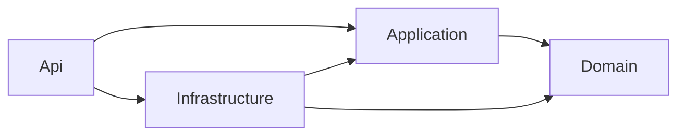

# FCG.UsersAPI

Microsserviço de usuários e autenticação do FIAP Cloud Games, desenvolvido para o Tech Challenge Fase 2 em **.NET 8**.

## Estado atual

**E08 concluída localmente em 05/10/2026:** refresh HTTP com rotação transacional e logout de todas as sessões renováveis do próprio usuário. Perfil/atividade atuais são consultados; concorrência entre refresh e logout coordenada no PostgreSQL.

**326 testes aprovados:** 100 unitários e 226 de integração/configuração/HTTP/segurança, executados em 05/10. Build Release sem erros/avisos e Kestrel real verificado. Consulte [evidências E08](docs/evidencias/E08/README.md).

O HTTP expõe saúde, cadastro, login, refresh e logout. Login/refresh devolvem access RS256 de 15 minutos, refresh com hash persistido/7 dias e usuario; nome/e-mail fora das claims. Logout revoga refreshs ativos; JWT emitido continua válido até expirar, com 30 segundos de tolerância.

Branch atual: feature/c10-migrar-dominio, base 5ba69b3 de E02–E04. E05–E08 no diretório de trabalho, **sem commit ou push**. Nenhum card encerrado.

## Pré-requisitos

- Git e SDK .NET **8.0.423** ou patch compatível conforme `global.json`.
- PowerShell **7 ou superior** para o roteiro local de geração/leitura de PEM.
- Docker Desktop com engine Linux funcionando para banco local e testes PostgreSQL.
- Acesso ao NuGet e, na primeira execução, às imagens usadas pelos testes.

RabbitMQ ainda não é necessário. O Docker pode precisar de diagnóstico se repetir o erro de endpoints observado nesta máquina; veja o [registro do ambiente](docs/evidencias/E05/AMBIENTE-DOCKER.md).

## Executar localmente

Na raiz do repositório, no PowerShell:

```powershell
dotnet tool restore
dotnet restore FCG.Users.sln
dotnet build FCG.Users.sln --configuration Release --no-restore
.\scripts\Configurar-PostgresLocal.ps1
.\scripts\Configurar-JwtLocal.ps1 -CriarChaves
dotnet tool run dotnet-ef database update --project src/FCG.Users.Infrastructure --startup-project src/FCG.Users.Infrastructure --configuration Release --no-build
dotnet run --project src/FCG.Users.Api --configuration Release --no-build --launch-profile http
```

Mantenha os comandos no mesmo terminal. O script configura `ConnectionStrings__UsersDatabase` para aquela sessão. Ele cria/reutiliza `fcg-usersapi-postgres`, com volume próprio e acesso local em **127.0.0.1:55432**. A senha aleatória fica em `.env.usersdb`, ignorado pelo Git; não compartilhe esse arquivo. O banco do monólito não é utilizado.

O roteiro de JWT gera o primeiro par RSA somente com `-CriarChaves`; se ele já existe, reutiliza os mesmos arquivos. A privada fica fora do repositório, em `%LOCALAPPDATA%\FCG.UsersAPI\jwt\users-local-v1`. Nas próximas sessões use o script sem `-CriarChaves`. Só a pública deve ser distribuída ao Catalog.

A API exige configuração válida da conexão e das chaves, mas não aplica migrations automaticamente. O perfil HTTP inicia em Development na porta **5088**. Encerre com `Ctrl+C`.

| Endereço | Resultado esperado |
|---|---|
| [GET /health](http://localhost:5088/health) | HTTP 200 e `{"status":"Healthy"}`. Confirma que o processo responde; não testa o banco. |
| `POST /api/v1/usuarios` | 201 para cadastro válido; 400 para dados inválidos; 409 para CPF/e-mail duplicado. |
| `POST /api/v1/auth/login` | Login: 200 no sucesso, 400 por entrada inválida e 401 por credenciais inválidas. Refresh/logout também estão conectados. |
| POST /api/v1/auth/refresh | 200 com novo par; 400 por entrada inválida; 401 por sessão inválida/inativa; não exige access. |
| POST /api/v1/auth/logout | Bearer obrigatório; 204 sem corpo, revoga todos os refreshs ativos do sub; 401 por access inválido. |
| [Swagger UI](http://localhost:5088/swagger/index.html) | Documentação disponível em Development com Swagger habilitado. |
| [OpenAPI JSON](http://localhost:5088/swagger/v1/swagger.json) | Descrição das rotas atuais. |
| `/rota-inexistente` | HTTP 404 no formato Problem Details. |

Não há página inicial em `/`; um 404 é esperado. O Swagger continua indisponível fora de Development, mesmo com sua flag ligada.

Para experimentar o cadastro, use o Swagger ou os exemplos de [FCG.Users.Api.http](src/FCG.Users.Api/FCG.Users.Api.http). Envie nome, CPF, nascimento no formato `AAAA-MM-DD`, e-mail e senha. O cliente não escolhe perfil nem estado do usuário. A resposta 201 inclui os dados públicos do cadastro, sem senha ou hash, e um cabeçalho `Location`. A consulta GET desse endereço será implementada na E09; ainda retorna 404.

E06–E08 reutilizam as tabelas criadas na E05 e não acrescentam migration. A API não registra o corpo do cadastro nos logs. O exemplo de senha no arquivo HTTP é fictício, destinado somente ao exercício local.

Para repetir o ciclo completo, após banco/migration/chaves e build, execute `./scripts/Verificar-SessaoLocal.ps1` no PowerShell 7. Cria sua API, demonstra login/refresh/logout, verifica banco e encerra o host iniciado. A conta sintética e três refreshs revogados ficam no banco. Porta 5088 livre; use -Porta 5089 se necessário.

## Testes

Com a solução compilada e Docker funcionando:

```powershell
dotnet test FCG.Users.sln --configuration Release --no-build --no-restore
```

O Testcontainers cria e descarta um PostgreSQL de testes, com porta aleatória e dados sintéticos. Não é necessário iniciar a API ou preparar o banco local para essa suíte. O host básico usa conexão fictícia; cadastro/login/refresh/logout usam PostgreSQL real. A suíte verifica hash, JWT, perfil atual, rotação/logout concorrentes, isolamento por usuário e rollback de cadastro/auditoria e sucessor de refresh.

Somente os unitários, sem Docker:

```powershell
dotnet test tests/FCG.Users.UnitTests --configuration Release --no-build --no-restore
```

## Organização

| Projeto/pasta | Responsabilidade |
|---|---|
| Api | Host ASP.NET Core, controllers, contratos e configuração HTTP. |
| Application | Casos de uso e interfaces de repositórios/segurança. |
| Domain | Entidades e invariantes; sem dependências de banco. |
| Infrastructure | Contexto, mapeamentos, migration, repositórios e implementações concretas de hash de senha. |
| UnitTests | Regras e coordenação dos casos de uso, com substitutos. |
| IntegrationTests | Host, ciclo de autenticação HTTP, configuração, hash e PostgreSQL real. |
| scripts | Preparação de banco/chaves e demonstrações sem imprimir credenciais. |
| docs | Guias, decisões, planejamento e evidências. |



Nenhum projeto depende de arquivos/assemblies do monólito. As versões estão em `Directory.Packages.props`; a ferramenta EF 8 local está em `.config/dotnet-tools.json`.

## Aprendizado e próximos passos

- [Guia E08](docs/aprendizado/E08-REFRESH-LOGOUT-E-CONCORRENCIA.md): renovação, logout, transação, concorrência e JWTs antigos.
- [Evidências E08](docs/evidencias/E08/README.md).
- [Guia didático da E07](docs/aprendizado/E07-LOGIN-E-JWT-RS256.md): login, access/refresh, assinatura, claims, chaves persistentes e exercícios.
- [Evidências da E07](docs/evidencias/E07/README.md).
- [Guia didático da E06](docs/aprendizado/E06-CADASTRO-HTTP-E-AUDITORIA.md): requisição, validação, hash, perfil padrão e auditoria atômica.
- [Evidências da E06](docs/evidencias/E06/README.md).
- [Guia didático da E05](docs/aprendizado/E05-PERSISTENCIA-PROPRIA.md): conceitos, decisões, concorrência, migrations e exercícios.
- [Evidências da E05](docs/evidencias/E05/README.md).
- [Índice dos guias anteriores](docs/README.md).
- [Plano dos cards #52 a #55](docs/planejamento/PLANO-EXECUCAO-USERSAPI-CARDS-52-55.md).
- [Modelagem e decisões](docs/planejamento/ANALISE-MODELAGEM-USERSAPI-E-DECISOES.md).

Próxima entrega: **E09**, operações protegidas, administração e demais auditorias. Restam **6 entregas, E09–E14**, para concluir o plano dos quatro cards. Avançamos em pequenos entregáveis, sem prazo fixo.
